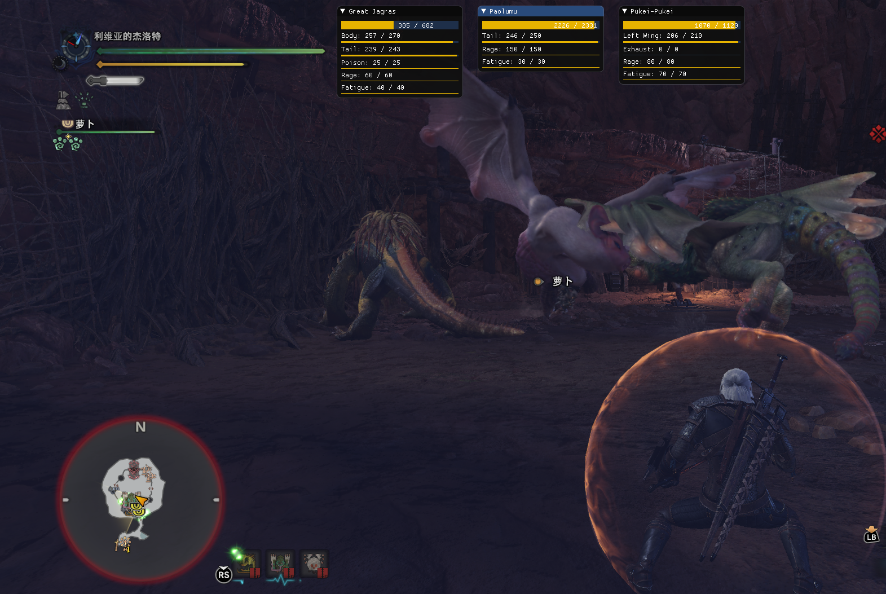

# Overlay Display Server

A DirectX9/10/11/12 in-game overlay with a WebSocket-based RPC that you can send Lua scripts to it to show any contents you want.


## The initial development

This project has just started, and it can run normally for the first time. Please understand any of its deficiencies (including the hard-coded file path. I will modify it later).


## Features

* A DirectX9/10/11/12 in-game overlay based [Indicium-Supra](https://github.com/nefarius/Indicium-Supra) with [dear imgui](https://github.com/ocornut/imgui). Compatible with full screen games.
* A quickly render script pipeline based on [LuaJIT-ImGui](https://github.com/sonoro1234/LuaJIT-ImGui) and [LuaJIT](http://luajit.org/).
* A JSON-RPC server via WebSocket, You can connect to it through any client (and more than one clients), send rendering scripts to it, and implement in-game overlay rendering.


## Purpose

Full-screen game overlays have been difficult to implement and require many DirectX Hook techniques. Although there are already some DirectX overlay libraries (like [DX9-Overlay-API](https://github.com/agrippa1994/DX9-Overlay-API) and [Indicium-Supra](https://github.com/nefarius/Indicium-Supra)), there is still a lack of out-of-box experience for MOD developers.

Especially for non-C/C++ developers, building code as a DLL and injecting it into the target game process can be quite unfamiliar.

In addition, porting existing games to DX overlay is also very difficult. Because the DX overlay usually needs to be implemented as an Immediate Mode GUI (requires efficient rendering in every frame, no compositing window manager can rely on).

Therefore, in order to solve these problems, the project provides a "compositing window manager" for the DX overlay.


## Demo




## Usage of the Console Client

```
help
```
```
Command List:
connect <ws uri>
send <connection id> <message>
close <connection id> [<close code:default=1000>] [<close reason>]
show <connection id>
help: Display this help text
quit: Exit the program
```

--------------------------------------------

```
connect ws://localhost:12345
show 0
```
```
> URI: ws://localhost:12345
> Status: Open
> Remote Server: WebSocket++/0.8.1
> Error/close reason: N/A
> Messages Processed: (0)
```

--------------------------------------------

```
send 0 {"widget":"date", "command":"set_render", "script":"ig.Text(os.date('%c'))"}
show 0
```

```
> URI: ws://localhost:12345
> Status: Open
> Remote Server: WebSocket++/0.8.1
> Error/close reason: N/A
> Messages Processed: (2)
>>  {"widget":"date", "command":"set_render", "script":"ig.Text(os.date('%c'))"}
<< {"id": "", "last_error": "", "status": "ok"}
```

--------------------------------------------

```
send 0 {"widget":"date", "command":"set_render", "script":"ig.Begin('Time', nil, imgui.ImGuiWindowFlags_AlwaysAutoResize); ig.Text(os.date('%c')); ig.End();"}
send 0 {"widget":"progress", "command":"set_render", "script":"ig.SetNextWindowPos(ig.ImVec2(300, 60)); ig.Begin('Progress', nil, imgui.ImGuiWindowFlags_AlwaysAutoResize); f = os.time()%100 / 100; ig.ProgressBar(f, ig.ImVec2(0, 0)); ig.End()"}
show 0
```

```
>>  {"widget":"date", "command":"set_render", "script":"ig.Begin('Time', nil, imgui.ImGuiWindowFlags_AlwaysAutoResize); ig.Text(os.date('%c')); ig.End();"}
<< {"id": "", "last_error": "", "status": "ok"}
>>  {"widget":"progress", "command":"set_render", "script":"ig.SetNextWindowPos(ig.ImVec2(300, 60)); ig.Begin('Progress', nil, imgui.ImGuiWindowFlags_AlwaysAutoResize); f = os.time()%100 / 100; ig.ProgressBar(f, ig.ImVec2(0, 0)); ig.End()"}
<< {"id": "", "last_error": "", "status": "ok"}
```

--------------------------------------------

```
send 0 {"widget":"progress", "command": "get_response", "script":"SetResponse('f='..tostring(f))"}
show 0
```

```
>>  {"widget":"progress", "command": "get_response", "script":"SetResponse('f='..tostring(f))"}
<< {"id": "", "last_error": "", "response": "f=0.9"}
```

--------------------------------------------

Recommended view update method:

```
send 0 {"widget":"progress2", "command":"set_render", "script":"ig.SetNextWindowPos(ig.ImVec2(500, 60)); ig.Begin('Progress2', nil, imgui.ImGuiWindowFlags_AlwaysAutoResize); ig.ProgressBar(f or 0, ig.ImVec2(0, 0)); ig.End()"}
send 0 {"widget":"progress2", "command": "update_view", "script":"f=0.33"}
send 0 {"widget":"progress2", "command": "update_view", "script":"f=0.54"}
send 0 {"widget":"progress2", "command": "update_view", "script":"f=0.66"}
send 0 {"widget":"progress2", "command": "update_view", "script":"f=0.98"}
send 0 {"widget":"progress2", "command": "remove_widget"}
show 0
```

Load a font:
```
send 0 {"widget":"text", "command": "update_view", "script":"ig.GetIO().Fonts:Clear(); ig.GetIO().Fonts:AddFontFromFileTTF('C:/Windows/Fonts/simhei.ttf', 18, nil, ig.GetIO().Fonts:GetGlyphRangesChineseFull()); UpdateFontCache()"}
send 0 {"widget":"text", "command":"set_render", "script":"ig.SetNextWindowPos(ig.ImVec2(500, 60)); ig.Begin('Text', nil, imgui.ImGuiWindowFlags_AlwaysAutoResize); ig.Text('Hello, \u4f60\u597d\u3002'); ig.End()"}
show 0
```


# Build

TODO: add documents
